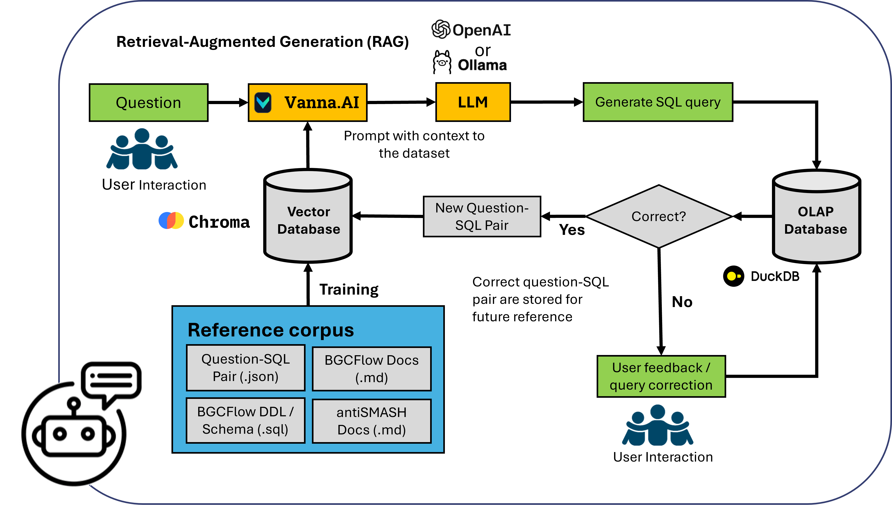

# chatBGC

<p align="center">
<a href="https://pypi.python.org/pypi/chatbgc">
    
</a>

<a href="https://github.com/NBChub/chatBGC/actions">
    
</a>

<a href="https://nbchub.github.io/chatBGC/">
    
</a>

</p>

Ask questions about BGCs in your genome dataset generated by [`BGCFlow`](https://github.com/NBChub/bgcflow) using Large Language Models (LLMs). 

This python package utilizes vector-based Retrieval-Augmented Generation (RAG) to translate natural language (English) to SQL Queries and is trained to query information from `antiSMASH` and other genome mining tools included in the [`BGCFlow`](https://github.com/NBChub/bgcflow) pipelines.



## Quickstart
For a quick use of `chatBGC`, you will need an [OpenAI API Key](https://platform.openai.com/api-keys) and the DuckDB database of your `BGCFlow` run (generated using `bgcflow build database`). See [BGCFlow Wiki](https://github.com/NBChub/bgcflow/wiki/04-Building-and-Serving-OLAP-Database) for more details on creating the database.

```bash
# Setup API Key
OPENAI_API_KEY="<change this to your API Key>"

# Create new folder to set up duckdb and vector database
mkdir chatbgc
cd chatbgc

# Copy the database build using BGCFlow to this directory
BGCFLOW_DIR="<change this to your BGCFlow directory>"
PROJECT_NAME="<change this to your BGCFlow project name>"
ANTISMASH_VERSION="7.1.0" # change this to the correct antiSMASH version used in your BGCFlow run. Only supports version 7.1.0 or above
cp $BGCFLOW_DIR/data/processed/$PROJECT_NAME/dbt/antiSMASH_7.1.0/dbt_bgcflow.duckdb dbt_bgcflow.duckdb -n

# Create python environment and install ChatBGC
python3 -m venv chatbgc_env
source chatbgc_env/bin/activate
python3 -m pip install --upgrade pip
pip install git+https://github.com/NBChub/chatBGC.git

# Setup variable environment / secrets
touch .env
echo "export OPENAI_API_KEY=$OPENAI_API_KEY" > .env
source .env

# Train ChatBGC (Do it once)
chatbgc train --llm_type openai_chat --model gpt-4o dbt_bgcflow.duckdb

# Run ChatBGC
chatbgc run --llm_type openai_chat --model gpt-4o dbt_bgcflow.duckdb
```

## Configuration

Before running chatBGC, you need to configure the language model platform you want to use: `Ollama` or `OpenAI Chat`.

### Ollama

If you're using Ollama, make sure you have it running as described in the Installation section.

### OpenAI Chat

If you're using OpenAI Chat, you need to set up an API key:

1. Sign up for an account on the [OpenAI website](https://www.openai.com/).
2. Navigate to the [API section](https://platform.openai.com/api-keys) and generate a new API key.
3. Set the API key as an environment variable on your system:

    ```bash
    export OPENAI_API_KEY="your-api-key"
    ```

Replace `"your-api-key"` with the API key you generated on the OpenAI website.

## Installation

Follow these steps to install and run chatBGC:

### 1. **Set up Ollama (Skip this step if you are using `OpenAI Chat`)**

    [Ollama](https://ollama.com/) is the default prerequisite for chatBGC. If you haven't installed it yet, you can do so using Docker:

    ```bash
    docker stop ollama
    docker rm ollama
    docker run -d -v ollama:/root/.ollama -p 11434:11434 --name ollama ollama/ollama
    docker exec -it ollama ollama run duckdb-nsql
    ```

### 2. **Installing chatBGC**
- Using Pip
    ```bash
    pip install git+https://github.com/NBChub/chatBGC.git
    ```
- From source
    Clone the chatBGC repository, navigate to the repository directory, and install the package using pip:

    ```bash
    git clone https://github.com/NBChub/chatBGC.git
    cd chatBGC
    pip install -e .
    ```

## Features

* Command-line interface for asking questions about biosynthetic gene clusters in your genome collection via LLMs using Retrieval-Augmented Generation (RAG).
* Connects to a DuckDB database using the vanna.ai library and starts a Flask app.

## Usage
### Step 1 - Training

Before running the chatBGC app, run the training using the given database first. You need to only do this once.

- **Train using Ollama**: To train chatBGC tool with default settings, use the following command:
```bash
chatbgc train <path_to_duckdb>
```

- **Train using OpenAI chat**: To train the chatBGC tool using OpenAI chat with GPT-4o, use the following command:

```bash
chatbgc train --llm_type openai_chat <path_to_duckdb>
```

### Step 2 - Run chatBGC
- **Run using Ollama**: To run the chatBGC tool with default settings, use the following command:

```bash
chatbgc run <path_to_duckdb>
```

- **Run using OpenAI chat**: To start the chatBGC tool using OpenAI chat with GPT-4o, use the following command:

```bash
chatbgc run --llm_type openai_chat <path_to_duckdb>
```

## Notes
* Free software: MIT
* Documentation: <https://nbchub.github.io/chatBGC/>

## Credits

This package was created with the [ppw](https://zillionare.github.io/python-project-wizard) tool. For more information, please visit the [project page](https://zillionare.github.io/python-project-wizard/).
